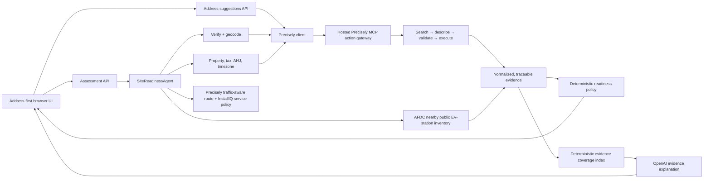

# InstallIQ

InstallIQ is a live pre-site intelligence workflow for commercial EV installations. It verifies a site, checks its operating area, preserves the evidence behind each fact, and prepares the next human survey action. It is not an electrical-feasibility engine, permit approval system, or installation quote.

## Start locally

```bash
npm install
cp .env.example .env.local
npm run dev
```

Set `INSTALLIQ_DATA_MODE=hosted`, the hosted Precisely MCP URL, and server-side Precisely credentials in `.env.local`. Browse to `http://localhost:3000` and enter a site name and installation address.

## Architecture



The browser never receives Precisely, AFDC, or OpenAI credentials and cannot select arbitrary tools. The server owns the MCP connection and uses an approved action registry. Every hosted call first searches for an action, describes its schema and examples, builds capability-specific arguments, validates them locally, then executes once. AFDC is a separate HTTPS source for public EV-station context. OpenAI is an explanation-only layer: it receives normalized facts, has no tools, cannot change policy, and falls back to deterministic wording on any error.

### Digital Evidence Coverage Index

InstallIQ also calculates a deterministic `0–100` Digital Evidence Coverage Index. It reports how much digital evidence was returned—not whether a site is good, feasible, permitted, serviceable, or approved. The published weights are site identity (30), service-area context (20), property context (20), jurisdiction context (15), and public EV-infrastructure context (15). Missing values earn no points; a routing fallback earns only the distance-evidence portion. OpenAI can explain the result but cannot calculate, modify, or reinterpret the numeric index.

## Live capabilities

| InstallIQ feature | Hosted action | Input built by InstallIQ |
| --- | --- | --- |
| Address suggestions | `geo_addressing.autocomplete` | Partial address, USA country, max five results |
| Address verification | `geo_addressing.verify_address` | Full address |
| Geocoding | `geo_addressing.geocode` | Full address |
| Contact checks | `verification.parse_name`, `verification.emails`, `verification.phones` | Action-specific wrapper/batch inputs |
| Tax context | `tax.jurisdiction` | Resolved longitude/latitude record |
| AHJ context | `emergency.services` | Resolved coordinate pair |
| Timezone | `timezone.lookup` | Resolved coordinate pair plus timestamp |
| Nearby physical-place context | `address_proximity.search` | Resolved coordinates, `physical-places` dataset, 0.5-mile radius |
| Driving route / travel time | `routing.directions` | Service-base and site coordinates |
| Property, building, parcel, roof context | `property.structure`, `property.buildings`, `property.parcels`, `property.roof_attributes` | Precisely ID returned by address verification |

Every unavailable action is shown as unavailable rather than fabricated. Nearby commercial-place results remain optional and do not establish EV charger inventory.

## Commands

```bash
npm run lint
npm run typecheck
npm test
npm run build
npm run mcp:verify
npm run mcp:tools
npm run mcp:describe -- "validate and standardize a street address"
npm run mcp:smoke
```

## Configuration

`local` connects to a locally running Precisely MCP server through `PRECISELY_MCP_URL`. `hosted` connects to the Precisely DIS action gateway. `PRECISELY_API_KEY` and `PRECISELY_API_SECRET` remain server-side and must never use a `NEXT_PUBLIC_` prefix.

`SERVICE_BASE_LATITUDE`, `SERVICE_BASE_LONGITUDE`, and `SERVICE_RADIUS_MILES` define InstallIQ's own operating area. When Precisely routing returns a result, the policy uses traffic-aware route miles and shows estimated drive time; straight-line Haversine distance remains a visible fallback only. Neither is an electrical-feasibility or permitting decision.

`GOOGLE_MAPS_API_KEY` powers the optional Google Maps 3D site canvas. It is a browser Maps key, so restrict it in Google Cloud by HTTP referrer for `localhost:3000` and your production domain. It must never be used in place of Precisely credentials.

`NREL_API_KEY` enables the server-side U.S. Alternative Fuels Data Center (AFDC) nearby public EV-station lookup. It is intentionally separate from the Precisely MCP layer. `EV_STATION_SEARCH_RADIUS_MILES` defaults to 5. An empty or failing AFDC integration becomes a visible data limitation; it never downgrades a site or changes the readiness policy.

`OPENAI_API_KEY` enables the optional structured assessment narrative. It is sent only normalized assessment facts, the deterministic evidence-coverage breakdown, and selected AFDC station records. The model cannot call APIs or MCP tools, and it must not claim electrical capacity, utility approval, permitting, site control, cost, construction feasibility, or live charger availability. It does not calculate or alter the coverage index or assessment policy.

See [the Precisely MCP server review](docs/precisely-mcp-server-review.md) for the server-selection decision and why the hosted Data Integrity Suite gateway remains the single active Precisely integration.
