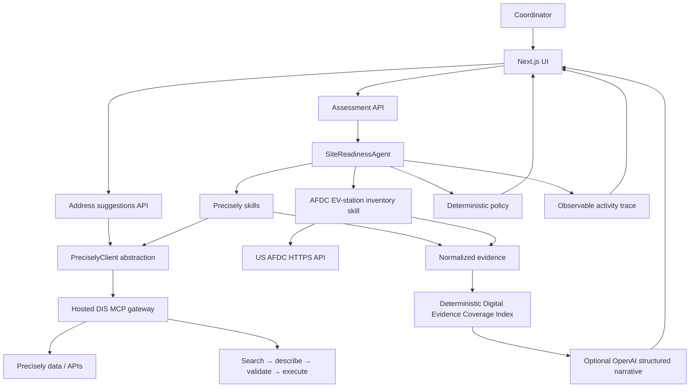

# InstallIQ

InstallIQ is a live pre-site intelligence workflow for commercial EV installations. It verifies a site, checks its operating area, preserves the evidence behind each fact, and prepares the next human survey action. It is not an electrical-feasibility engine, permit approval system, or installation quote.

## Start locally

```bash
npm install
cp .env.example .env.local
npm run dev
```

Set `INSTALLIQ_DATA_MODE=hosted`, the hosted Precisely MCP URL, and server-side Precisely credentials in `.env.local`. Browse to `http://localhost:3000` and enter a site name and installation address.

## Architecture

# Architecture



The browser submits only an installation request; it cannot name or invoke MCP tools. The agent runs optional contact checks, then address resolution. An unresolved address stops all site-specific enrichment. On resolution, the independent Precisely skills, the AFDC public EV-station lookup, and the service-area skill run concurrently.

The hosted Data Integrity Suite MCP gateway is the active Precisely integration. Every approved capability follows search → describe → schema validation → execute, against a fixed capability-to-action map held server-side; the semantic search result is only accepted when it contains the approved action ID. The app uses it for address autocomplete, address identity, coordinates, property/building/parcel/roof observations, tax and AHJ context, timezone, nearby physical places, and routing. In `local` mode the same client falls back to name-matching whatever tools a local Precisely MCP server exposes. Precisely results remain distinct from AFDC data and InstallIQ calculations.

The final policy and the Digital Evidence Coverage Index are deterministic. The index has published weights for returned site identity, service-area, property, jurisdiction, and public-EV-infrastructure evidence. It is a data-coverage measure only—not a feasibility, site-quality, permitting, cost, capacity, or approval score. OpenAI is optional and explanation-only: it receives normalized facts plus that fixed breakdown, has no tools, cannot change policy or score, and is constrained to state data limitations rather than infer electrical capacity, permits, utility approval, costs, site control, or charger availability. When no key is configured or the call fails, a deterministic rules brief is returned instead and labelled as such.

## Code map

| Layer | Files | Responsibility |
| --- | --- | --- |
| UI | `app/page.tsx`, `components/install-request-form.tsx`, `components/assessment-dashboard.tsx`, `components/detailed-site-report.tsx`, `components/site-map.tsx`, `components/agent-activity.tsx`, `components/raw-evidence-drawer.tsx` | Address-first intake, the four-tab report, the Google Maps site canvas, and the evidence/trace views |
| API | `app/api/assessment`, `app/api/address-suggestions`, `app/api/health`, `app/api/mcp/health`, `app/api/maps/config` | Request validation, one MCP connection per assessment, capability health, and the browser Maps key |
| Agent | `lib/agent/site-readiness-agent.ts`, `policy.ts`, `explanation.ts`, `digital-evidence-score.ts`, `assessment-brief-agent.ts` | Orchestration, the deterministic status and next action, the coverage index, and the optional narrative |
| Skills | `lib/skills/*` | One capability group each; every skill returns `{ data, evidence, warnings, trace }` |
| Precisely | `lib/precisely/*` | `createPreciselyClient` selects `ActionGatewayAdapter` (hosted) or `DirectToolAdapter` (local); normalization, redaction, and evidence wrapping live alongside |
| Domain | `lib/domain/*` | Zod request schema, result/evidence/trace types, status list, and charger-pin grouping |
| Config | `lib/config/env.ts`, `lib/config/service-area.ts` | Zod-validated environment and the Haversine fallback |

## Evidence and trace

Every external call is wrapped as `Evidence` with a provider (`Precisely`, `AFDC`, or `InstallIQ`), a transport, a capability, the resolved tool or action name, a retrieval timestamp, and the raw payload when one exists. `not_requested`, `not_found`, `unavailable`, and `error` are distinct states, so the UI can distinguish "we did not ask" from "the source had nothing" from "the source failed". Trace events record each skill start, tool call, decision, and stop, and are rendered as the action log.

### Request flow

1. `InstallRequestForm` collects a site name and an installation address. Typing three or more characters debounces a call to `/api/address-suggestions`, which runs `geo_addressing.autocomplete` server-side and returns up to five labels.
2. `POST /api/assessment` validates the request with Zod, opens one MCP connection, and runs `SiteReadinessAgent`.
3. The agent runs the optional contact check, then address verification and geocoding. **An unresolved address stops all site-specific enrichment** and returns `ADDRESS_CORRECTION_REQUIRED`.
4. On resolution, property, jurisdiction, site context, service area, and the AFDC EV-station lookup run concurrently.
5. A deterministic policy picks the status, a deterministic index scores evidence coverage, and the optional OpenAI brief explains the result. Every skill contributes normalized evidence and trace events that ship with the response.

Assessment statuses are `FIELD_SURVEY_REQUIRED`, `ADDRESS_CORRECTION_REQUIRED`, `MANUAL_DATA_REVIEW`, `OUTSIDE_SERVICE_AREA`, and `SYSTEM_ERROR`.

### Report UI

The result view is a single workspace: a verdict line with the plain-language summary and evidence chips, a Google Maps 3D site canvas that can reframe between the site and the returned charger pins, and four tabs.

| Tab | Shows |
| --- | --- |
| Overview | Site-findings table with a per-row source label, the survey plan or next steps, and any data notes |
| Site record | Accordion over site identity, service area, jurisdiction, and property fields; each row carries its source and reads "Not reported" when the source returned nothing |
| Public charging | AFDC station table with map-pin numbers, connectors, distance, and last-confirmed date |
| Source activity | The agent action log and the collapsed raw source responses |

### Digital Evidence Coverage Index

InstallIQ also calculates a deterministic `0–100` Digital Evidence Coverage Index. It reports how much digital evidence was returned—not whether a site is good, feasible, permitted, serviceable, or approved. Missing values earn no points; a routing fallback earns only the distance-evidence portion. OpenAI can explain the result but cannot calculate, modify, or reinterpret the numeric index.

| Factor | Weight | Earned for |
| --- | --- | --- |
| Site identity | 30 | Resolved address (15), standardized address (5), coordinates (5), Precisely ID (5) |
| Service-area context | 20 | Distance plus an inside/outside result (10), a usable Precisely route (10) |
| Property context | 20 | Building, parcel, roof, and use/year fields (5 each) |
| Jurisdiction context | 15 | Tax jurisdiction (5), AHJ (5), timezone (5) |
| Public EV context | 15 | The AFDC inventory responded; station count does not change the score |

Bands: `Strong` at 80 or above, `Developing` at 50 or above, otherwise `Limited`.

## Live capabilities

| InstallIQ feature | Hosted action | Input built by InstallIQ |
| --- | --- | --- |
| Address suggestions | `geo_addressing.autocomplete` | Partial address, USA country, max five results |
| Address verification | `geo_addressing.verify_address` | Full address |
| Geocoding | `geo_addressing.geocode` | Full address |
| Contact checks | `verification.parse_name`, `verification.emails`, `verification.phones` | Action-specific wrapper/batch inputs |
| Tax context | `tax.jurisdiction` | Resolved longitude/latitude record |
| AHJ context | `emergency.services` | Resolved coordinate pair |
| Timezone | `timezone.lookup` | Resolved coordinate pair plus timestamp |
| Nearby physical-place context | `address_proximity.search` | Resolved coordinates, `physical-places` dataset, 0.5-mile radius |
| Driving route / travel time | `routing.directions` | Service-base and site coordinates |
| Property, building, parcel, roof context | `property.structure`, `property.buildings`, `property.parcels`, `property.roof_attributes` | Precisely ID returned by address verification |

Every unavailable action is shown as unavailable rather than fabricated. Nearby commercial-place results remain optional and do not establish EV charger inventory. The contact actions only run when a contact name, email, or phone is supplied; the current form does not collect them, so they normally report "Not supplied".

## Commands

```bash
npm run dev
npm run lint
npm run typecheck
npm test                 # Vitest unit suite
npm run test:e2e         # Playwright, starts the dev server on port 3100
npm run build
npm run mcp:verify       # Connection + capability report
npm run mcp:tools        # Every discovered MCP tool and its input schema
npm run mcp:smoke        # One live ADDRESS_VERIFY call
npm run mcp:catalog      # Semantic action search across InstallIQ's goals
npm run mcp:inspect -- tax.jurisdiction   # Raw describe output for named action IDs
npm run mcp:describe -- "validate and standardize a street address"
```

## Configuration

`INSTALLIQ_DATA_MODE=hosted` connects to the Precisely DIS action gateway; `local` connects to a locally running Precisely MCP server through `PRECISELY_MCP_URL` and maps its tools by name. `PRECISELY_API_KEY` and `PRECISELY_API_SECRET` remain server-side, are combined into an `Authorization: Apikey <base64(key:secret)>` header, and must never use a `NEXT_PUBLIC_` prefix.

`SERVICE_BASE_LATITUDE`, `SERVICE_BASE_LONGITUDE`, and `SERVICE_RADIUS_MILES` define InstallIQ's own operating area. When Precisely routing returns a result, the policy uses traffic-aware route miles and shows estimated drive time; straight-line Haversine distance remains a visible fallback only. Neither is an electrical-feasibility or permitting decision.

`GOOGLE_MAPS_API_KEY` powers the Google Maps site canvas, served to the browser through `/api/maps/config`. It is a browser Maps key, so restrict it in Google Cloud by HTTP referrer for `localhost:3000` and your production domain. It must never be used in place of Precisely credentials. Without WebGL2 the canvas falls back to a 2D hybrid map, and without a key it falls back to the address and coordinates.

`NREL_API_KEY` enables the server-side U.S. Alternative Fuels Data Center (AFDC) nearby public EV-station lookup. It is intentionally separate from the Precisely MCP layer, requests at most twelve public, operational stations, and times out after eight seconds. `EV_STATION_SEARCH_RADIUS_MILES` defaults to 5. An empty or failing AFDC integration becomes a visible data limitation; it never downgrades a site or changes the readiness policy.

`OPENAI_API_KEY` enables the optional structured assessment narrative, with the model set by `OPENAI_MODEL` (default `gpt-5`). It is sent only normalized assessment facts, the deterministic evidence-coverage breakdown, and up to three AFDC station records. The model cannot call APIs or MCP tools, and it must not claim electrical capacity, utility approval, permitting, site control, cost, construction feasibility, or live charger availability. It does not calculate or alter the coverage index or assessment policy. Without a key, or on any error, the deterministic rules brief is used instead and the response is labelled `source: "rules"`.

See [the Precisely MCP server review](docs/precisely-mcp-server-review.md) for the server-selection decision and why the hosted Data Integrity Suite gateway remains the single active Precisely integration, and [docs/limitations.md](docs/limitations.md) for what this prototype deliberately does not do.
