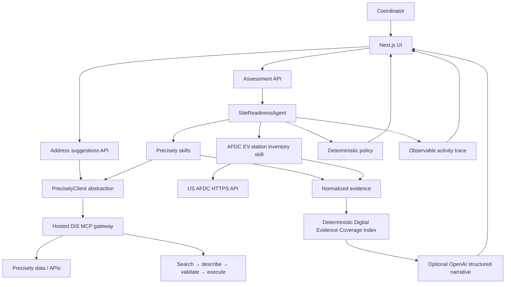

# InstallIQ — Implementation & Precisely Integration

InstallIQ is a live pre-site intelligence workflow for commercial EV installations. Given a business name and an installation address it verifies the site, checks whether the site is inside InstallIQ's operating area, preserves the evidence behind every fact, scores how much was established digitally, and states the next human survey action. It is **not** an electrical-feasibility engine, a permit-approval system, or an installation quote.

This document explains everything the prototype implements, which Precisely resources it uses and why, how the hosted Data Integrity Suite (DIS) MCP gateway exposes the Precisely APIs, and which Precisely best practices the integration follows. It supersedes the previous split docs (architecture, capability map, MCP server review, live setup, limitations, demo script).

---

## 1. Architecture



The browser submits only an installation request; it cannot name or invoke MCP tools. The agent starts with address resolution — an unresolved address stops all site-specific enrichment. Once the site resolves, the independent Precisely skills, the AFDC public EV-station lookup, and the service-area skill run concurrently.

The final policy and the Digital Evidence Coverage Index are deterministic. OpenAI is optional and explanation-only: it receives normalized facts plus the fixed coverage breakdown, has no tools, and cannot change the policy or the score. With no key or on any error, a deterministic rules brief is returned instead and labelled as such.

### Request flow

1. `InstallRequestForm` collects a site name and an installation address. Typing three or more characters debounces a call to `/api/address-suggestions`, which runs `geo_addressing.autocomplete` server-side and returns up to five labels.
2. `POST /api/assessment` validates the request with Zod, opens **one** MCP connection, and runs `SiteReadinessAgent`.
3. The agent runs address verification and geocoding. **An unresolved address stops all site-specific enrichment** and returns `ADDRESS_CORRECTION_REQUIRED`.
4. On resolution, property, jurisdiction, site context, service area, and the AFDC EV-station lookup run concurrently.
5. A deterministic policy picks the status, a deterministic index scores evidence coverage, and the optional OpenAI brief explains the result. Every skill contributes normalized evidence and trace events that ship with the response.

Assessment statuses: `FIELD_SURVEY_REQUIRED`, `ADDRESS_CORRECTION_REQUIRED`, `MANUAL_DATA_REVIEW`, `OUTSIDE_SERVICE_AREA`, `SYSTEM_ERROR`.

### Code map

| Layer | Files | Responsibility |
| --- | --- | --- |
| UI | `app/page.tsx`, `components/install-request-form.tsx`, `components/assessment-dashboard.tsx`, `components/detailed-site-report.tsx`, `components/site-map.tsx`, `components/agent-activity.tsx`, `components/raw-evidence-drawer.tsx` | Address-first intake, the four-tab report, the Google Maps site canvas, and the evidence/trace views |
| API | `app/api/assessment`, `app/api/address-suggestions`, `app/api/health`, `app/api/mcp/health`, `app/api/maps/config` | Request validation, one MCP connection per assessment, capability health, and the browser Maps key |
| Agent | `lib/agent/site-readiness-agent.ts`, `policy.ts`, `explanation.ts`, `digital-evidence-score.ts`, `assessment-brief-agent.ts` | Orchestration, the deterministic status and next action, the coverage index, and the optional narrative |
| Skills | `lib/skills/*` | One capability group each; every skill returns `{ data, evidence, warnings, trace }` |
| Precisely | `lib/precisely/*` | `createPreciselyClient` selects `ActionGatewayAdapter` (hosted) or `DirectToolAdapter` (local); normalization, redaction, and evidence wrapping live alongside |
| Domain | `lib/domain/*` | Zod request schema, result/evidence/trace types, status list, and charger-pin grouping |
| Config | `lib/config/env.ts`, `lib/config/service-area.ts` | Zod-validated environment and the Haversine fallback |

---

## 2. Precisely resources used, and why

InstallIQ never addresses Precisely by raw tool name. It uses internal **capability** names (the `PreciselyCapability` union in `lib/precisely/types.ts` is the single source of truth). In hosted mode each capability is bound to exactly one approved DIS action ID; in local mode the capability is matched to a locally discovered tool name.

| InstallIQ skill | Capability | Approved hosted action | Required? | Why InstallIQ uses it |
| --- | --- | --- | --- | --- |
| Address suggestions (`/api/address-suggestions`) | `ADDRESS_AUTOCOMPLETE` | `geo_addressing.autocomplete` | Optional | Reduce mistyped intake addresses at the source |
| Address Resolution | `ADDRESS_VERIFY` | `geo_addressing.verify_address` | **Yes** | Establish a single, standardized physical site identity |
| Address Resolution | `ADDRESS_GEOCODE` | `geo_addressing.geocode` | **Yes** | Obtain coordinates and the **PreciselyID** that keys all later lookups |
| Property Intelligence | `PROPERTY_ATTRIBUTES`, `BUILDING_INFORMATION`, `PARCEL_INFORMATION`, `ROOF_ATTRIBUTES` | `property.structure`, `property.buildings`, `property.parcels`, `property.roof_attributes` | Optional but important | Structure/building/parcel/roof context, keyed to the PreciselyID so every field describes the same site |
| Jurisdiction Context | `TAX_JURISDICTION`, `AUTHORITY_HAVING_JURISDICTION` | `tax.jurisdiction`, `emergency.services` | Optional | Who has authority over the location — context, not a permit determination |
| Site Context | `TIMEZONE` | `timezone.lookup` | Optional | Operational timezone for the site |
| Service Area | `ROUTE_OR_TRAVEL_TIME` | `routing.directions` | **Yes** | Traffic-aware drive distance/time against InstallIQ's configured operating boundary; Haversine remains a transparent fallback |

Precisely supplies facts where available. InstallIQ supplies orchestration, safe stopping rules, the operating-area policy, the evidence-coverage index, and the next best action. AFDC public EV-station inventory is an additional **non-MCP** public source, deliberately reported separately from Precisely facts. Field inspection and external authorities remain responsible for engineering, permitting, utility, and physical-site facts.

### Why the hosted DIS gateway (and not the other Precisely servers)

Reviewed against InstallIQ's scope — trusted digital pre-site intelligence, not electrical design, permit approval, or a general data-management platform:

| Precisely offering | Assessment | Decision |
| --- | --- | --- |
| **Data Integrity Suite hosted MCP** (`precisely-dis-mcp`) | Hosted action gateway with dynamic semantic discovery, descriptions, schema validation, and action execution. Current credentials already connect to it. Covers address, geocode, property, roof, tax, emergency/AHJ, timezone, and routing when enabled in the tenant catalog. | **Primary integration.** |
| DIS / Locate APIs v2 (`precisely-dis-locate`) | Large location tool surface but overlaps the hosted DIS location actions and requires running a Python server. | Not added — duplicates the active hosted integration. |
| Geographic Addressing SDK (`precisely-ga-sdk`) | Local licensed SDK for verify/geocode. | Not added — duplicates hosted address verification and needs a separate SDK/reference-data install. |
| GeoTAX SDK (`precisely-geotax-sdk`) | Detailed tax-rate lookups, separate local service/license. | Future optional — only if tax-rate economics becomes an explicit requirement. |
| MapInfo Pro (`precisely-mapinfo-pro`) | Desktop automation and map/layout tooling. | Not added — for analyst-authored map packages, not a request-time dashboard. |
| Spectrum, Trillium, Analyze, DQ+, Enterworks, Matching, Connect | Enterprise data-quality/matching/catalog/ETL/governance with separate runtimes. | Out of scope for request-time assessment; consider later for CRM/master-data. |

The architecture intentionally uses **one governed Precisely action gateway** rather than wiring up multiple overlapping MCP servers. Every additional source must have a distinct business purpose and a visible evidence label, which is why AFDC is connected separately as HTTPS data rather than presented as Precisely data.

---

## 3. How the DIS MCP gateway exposes the Precisely APIs

The hosted DIS gateway does not expose one MCP tool per Precisely API. Instead it exposes a small set of **meta-tools** that front a catalog of governed *actions*:

- `precisely_actions_search` — semantic discovery: given a natural-language *goal*, return candidate `action_id`s.
- `precisely_actions_describe` — return an action's `inputs_schema` (and examples).
- `precisely_actions_execute` — run an action by `action_id` with validated `arguments`.

InstallIQ's hosted adapter (`lib/precisely/action-gateway-adapter.ts`) turns a capability into a result through a fixed **search → describe → validate → execute** loop:

1. **Feature-detect direct tools first.** On connect the adapter lists the server's tools. If the gateway happens to expose a direct tool that already maps to the capability, it is used and the meta-tool loop is skipped. Otherwise the loop runs.
2. **Search (governed, not blind).** The adapter calls `precisely_actions_search` with a capability-specific goal string (e.g. *"validate and standardize a street address"*) and `max_results: 8`. Crucially, it does **not** trust the top-ranked result: it scans the whole candidate list for the **exact approved `action_id`** from InstallIQ's allowlist. If that action is not present, the capability is reported `unavailable` — it is never substituted.
3. **Describe.** The chosen `action_id` is passed to `precisely_actions_describe` to fetch the current `inputs_schema`. If the gateway returns no schema, execution stops with an error rather than guessing.
4. **Validate.** InstallIQ transforms its capability input into the action's argument shape (`transformInput`) and validates it against the described schema (`buildArguments`): unknown fields are rejected, required fields are checked. Only a valid argument object proceeds.
5. **Execute.** `precisely_actions_execute` is called with `{ action_id, arguments }`. The result's `structuredContent` (or `content`) is unwrapped, and an **action-level error inside a successful MCP envelope** is detected and surfaced as an error rather than a false success.

Resolved mappings (`capability → action_id`) and described schemas (`action_id → inputs_schema`) are **cached per connection**, so each capability searches/describes at most once per assessment.

**Connection & auth.** `createPreciselyClient` builds one client per assessment over the MCP Streamable HTTP transport. Credentials stay server-side and are combined into an `Authorization: Apikey <base64(api_key:api_secret)>` header. Local mode (`DirectToolAdapter`) connects to a locally running Precisely MCP server and maps its tools by conservative name matching (`lib/precisely/capability-registry.ts`).

---

## 4. Precisely best practices the integration follows

The integration is built to Precisely's DIS MCP guidance — discover, describe, validate, then execute — with additional governance:

- **Discover, don't hardcode endpoints.** Actions are found through the gateway's own semantic search rather than pinned to brittle URLs.
- **Least-privilege, allowlisted actions.** Discovery is constrained to an explicit approved-action map. The gateway can only ever execute an action whose exact approved ID appears in its own search results, keeping behaviour deterministic and auditable.
- **Never guess a schema.** Every action is described and its input validated before execution; an action with no usable schema, or with unknown/missing fields, is stopped rather than sent speculatively.
- **Entity resolution first.** Address verify + geocode yield the **PreciselyID**, and all property/building/parcel/roof lookups query by `PRECISELY_ID` so every returned field provably describes the same site.
- **Request only the fields you need.** Property actions pass an explicit `fields` list instead of pulling full records.
- **Scope inputs.** Address inputs are country-scoped (`USA`/`US`).
- **Server-side credentials only.** API key/secret never use a `NEXT_PUBLIC_` prefix, never reach the browser, and are sent only as the base64 `Apikey` header.
- **One connection per unit of work.** Each assessment opens and closes a single MCP connection; discovery results are cached within it.
- **Honest provenance.** Unavailable actions are reported as unavailable, never fabricated; non-Precisely sources (AFDC) are labelled distinctly and never presented as Precisely facts.

---

## 5. Evidence, trace, and the report UI

### Evidence and trace

Every external call is wrapped as `Evidence` with a provider (`Precisely`, `AFDC`, or `InstallIQ`), a transport, a capability, the resolved tool or action name, a retrieval timestamp, and the raw payload when one exists. The states `not_requested`, `not_found`, `unavailable`, and `error` are distinct, so the UI can tell "we did not ask" from "the source had nothing" from "the source failed". Trace events record each skill start, tool call, decision, and stop, and are rendered as the action log.

### Report UI

The result view is a single workspace: a verdict line with a plain-language summary and evidence chips, a Google Maps 3D site canvas that can reframe between the site and the returned charger pins, and four tabs.

| Tab | Shows |
| --- | --- |
| Overview | Site-findings table with a per-row source label, the survey plan or next steps, and any data notes |
| Site record | Accordion over site identity, service area, jurisdiction, and property fields; each row carries its source and reads "Not reported" when the source returned nothing |
| Public charging | AFDC station table with map-pin numbers, connectors, distance, and last-confirmed date |
| Source activity | The agent action log and the collapsed raw source responses |

### Digital Evidence Coverage Index

A deterministic `0–100` index reports **how much** digital evidence was returned — not whether a site is good, feasible, permitted, serviceable, or approved. Missing values earn no points; a routing fallback earns only the distance-evidence portion. OpenAI can explain the result but cannot calculate, modify, or reinterpret the number.

| Factor | Weight | Earned for |
| --- | --- | --- |
| Site identity | 30 | Resolved address (15), standardized address (5), coordinates (5), PreciselyID (5) |
| Service-area context | 20 | Distance plus an inside/outside result (10), a usable Precisely route (10) |
| Property context | 20 | Building, parcel, roof, and use/year fields (5 each) |
| Jurisdiction context | 15 | Tax jurisdiction (5), AHJ (5), timezone (5) |
| Public EV context | 15 | The AFDC inventory responded; station count does not change the score |

Bands: `Strong` at 80+, `Developing` at 50+, otherwise `Limited`.

---

## 6. Live setup

Live data is the only data path. If credentials or the MCP endpoint are unavailable, the assessment fails and is shown as a failure — there is no fixture mode.

### Hosted DIS gateway (default)

1. In `.env.local` set `INSTALLIQ_DATA_MODE=hosted` and `PRECISELY_MCP_URL=https://api.cloud.precisely.com/dis-mcp/mcp`.
2. Set `PRECISELY_API_KEY` and `PRECISELY_API_SECRET`. The server builds the `Authorization: Apikey <base64(api_key:api_secret)>` header from them. Never place API keys in `NEXT_PUBLIC_*` variables, browser requests, logs, or committed files.
3. Run `npm run mcp:verify` to confirm the connection and that capabilities are searched and schema-described on demand.
4. Run `npm run mcp:smoke` for one live `ADDRESS_VERIFY` call (override with `INSTALLIQ_SMOKE_ADDRESS`).
5. Start InstallIQ and run one low-risk assessment.

Helper scripts when a tenant catalog changes:

- `npm run mcp:catalog` — semantic search for every goal InstallIQ cares about; prints candidate action IDs.
- `npm run mcp:inspect -- property.roof_attributes tax.jurisdiction` — raw describe payload (including input schema) for named action IDs.
- `npm run mcp:describe -- "validate and standardize a street address"` — search by goal and describe the top action; `-- --action geo_addressing.verify_address` skips the search (hosted mode only).

### Local Precisely MCP server

1. Clone Precisely's official `PreciselyData/precisely-mcp-servers` repository and follow its Locate MCP setup and HTTP transport instructions; configure its credentials outside this repo.
2. Start its HTTP MCP transport (InstallIQ's local default is `http://127.0.0.1:8000/mcp`).
3. Set `INSTALLIQ_DATA_MODE=local` and `PRECISELY_MCP_URL` in `.env.local`.
4. Run `npm run mcp:verify` to list discovered capabilities and `npm run mcp:tools` to see every tool and its input schema. Local mode maps tools by conservative name matching — check this list before trusting a new deployment.

`GET /api/mcp/health` returns the runtime picture: connection state, discovered capability count, and which required capabilities (`ADDRESS_VERIFY`, `ADDRESS_GEOCODE`) resolved.

### Non-Precisely keys

Independent of the MCP layer; each degrades visibly rather than blocking an assessment:

- `NREL_API_KEY` — AFDC public EV-station context, with `EV_STATION_SEARCH_RADIUS_MILES` (default 5). Requests at most twelve public, operational stations and times out after eight seconds.
- `GOOGLE_MAPS_API_KEY` — the browser map canvas, served through `/api/maps/config`. Restrict it by HTTP referrer in Google Cloud. Without WebGL2 the canvas falls back to a 2D hybrid map; without a key it falls back to address and coordinates.
- `OPENAI_API_KEY` / `OPENAI_MODEL` (default `gpt-5`) — the explanation-only narrative. Without them, the deterministic rules brief is used and the response is labelled `source: "rules"`.

### Commands

```bash
npm run dev
npm run lint
npm run typecheck
npm test                 # Vitest unit suite
npm run test:e2e         # Playwright, starts the dev server on port 3100
npm run build
npm run mcp:verify       # Connection + capability report
npm run mcp:tools        # Every discovered MCP tool and its input schema
npm run mcp:smoke        # One live ADDRESS_VERIFY call
npm run mcp:catalog      # Semantic action search across InstallIQ's goals
npm run mcp:inspect -- tax.jurisdiction
npm run mcp:describe -- "validate and standardize a street address"
```

---

## 7. Limitations

### Scope

- InstallIQ does not determine electrical capacity, transformer or panel capacity, existing load, utility interconnection, permit approval, conduit or trenching paths, ADA design, physical obstructions, cost, or installation approval. Those are the field-survey gaps listed on every assessment.
- Jurisdiction and AHJ context identify who has authority; they are not a permit determination.
- The operating-area check is InstallIQ's own configured policy (`SERVICE_BASE_*`, `SERVICE_RADIUS_MILES`), not a Precisely finding. It uses the Precisely traffic-aware route when returned and falls back to a visibly labelled straight-line Haversine distance otherwise (in which case drive time is not established).
- The Digital Evidence Coverage Index measures how much digital evidence came back. It is not a site-quality, feasibility, permitting, capacity, cost, or approval score.
- AFDC public-station records describe nearby public infrastructure; they do not confirm on-site capacity, ownership, live availability, or a need for new chargers, and pin positions are AFDC coordinates rather than verified charger placement.

### Data

- Live availability depends on the enabled Precisely products and action contracts in the tenant catalog; an action that is not enabled is reported unavailable rather than substituted.
- Hosted gateway actions are never guessed. InstallIQ executes only a capability whose approved action ID is returned by the gateway's own search and whose current schema accepts InstallIQ's arguments.
- Local-mode tool mapping uses conservative name matching. Inspect `npm run mcp:tools` before trusting a new local deployment.
- Property fields arrive per-source and are merged first-non-empty; sentinel values such as `-1` render as "Not reported" rather than zero.

### Prototype boundaries

- No authentication, database, CRM, dispatching, or report export. Every assessment is ephemeral and lives only in the browser tab that ran it.
- No mock or fixture data mode. With no MCP endpoint configured the assessment API fails, by design.
- The request form collects only a site name and address. The request model still carries charger type/count, so those are submitted as `UNKNOWN`/`1`.
- Raw source responses render in the evidence drawer as returned. The `redact` helper exists in `lib/precisely/redact.ts` but is not yet applied to that view, so treat the drawer as unredacted.
- The Playwright suite covers one report path and currently asserts the pre-redesign dashboard markup, so `npm run test:e2e` fails until it is updated. `npm run lint`, `npm run typecheck`, and `npm test` pass.
- `components/status-banner.tsx`, `assessment-rail.tsx`, `site-stats-bento.tsx`, `digital-evidence-coverage.tsx`, and `evidence-explanation-panels.tsx` are left over from the earlier dashboard and are no longer rendered.

---

## 8. Five-minute demo script

Run with `INSTALLIQ_DATA_MODE=hosted` and live Precisely credentials. Confirm the connection first with `npm run mcp:verify`, and `npm run mcp:smoke` for a single live address call. There is no fixture mode, so a broken endpoint shows as a failure rather than a demo.

- **0:00–0:30 — The question.** "Before sending an engineer to a commercial EV installation site, how much can we establish digitally, and can we prove where every fact came from?"
- **0:30–1:00 — Intake.** Show the start screen and the `Live Precisely data` badge. Type an address such as `21001 N Tatum Blvd, Phoenix, AZ` and let suggestions appear — those come from `geo_addressing.autocomplete` running server-side, not the browser. The browser sends a business request and never names a tool.
- **1:00–2:00 — The verdict.** Submit and land on the report. Read the verdict line and evidence chips. The status is deterministic policy; the sentence beside it is an explanation layer that cannot change the status — with no OpenAI key it is written by rules.
- **2:00–3:00 — Site and surroundings.** Use the map. Switch focus from **Site** to **Chargers** to reframe onto the AFDC public stations, then open the **Public charging** tab to match the numbered pins to the station table. These are nearby public stations, not on-site capacity.
- **3:00–4:00 — The record.** Open the **Site record** tab and expand Site identity, then Property. Every row names its source and says "Not reported" when the source returned nothing. The service-area row's decision metric says whether the driving route or the straight-line fallback was used.
- **4:00–4:40 — Provenance.** Open the **Source activity** tab. Walk the action log — skill starts, tool calls, the address gate, the policy decision — then expand one raw source response to show the action ID and timestamp behind a fact.
- **4:40–5:00 — The claim.** "The system never asks a model to invent physical site facts. Precisely provides trusted evidence, AFDC provides separately labelled public-charging context, and the agent decides what to collect and what should happen next. Electrical capacity, permitting, and utility interconnection stay with the field survey." The hypothesis: less avoidable pre-survey work, better field preparation, and an auditable request-to-survey flow.
