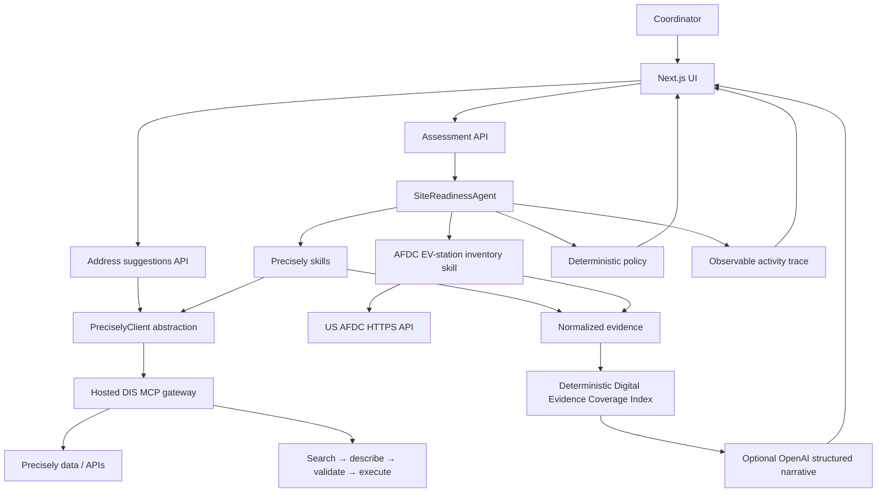

# Architecture

The browser submits only an installation request; it cannot name or invoke MCP tools. The agent runs optional contact checks, then address resolution. An unresolved address stops all site-specific enrichment. On resolution, the independent Precisely skills, the AFDC public EV-station lookup, and the service-area skill run concurrently.

The hosted Data Integrity Suite MCP gateway is the active Precisely integration. Every approved capability follows search → describe → schema validation → execute, against a fixed capability-to-action map held server-side; the semantic search result is only accepted when it contains the approved action ID. The app uses it for address autocomplete, address identity, coordinates, property/building/parcel/roof observations, tax and AHJ context, timezone, nearby physical places, and routing. In `local` mode the same client falls back to name-matching whatever tools a local Precisely MCP server exposes. Precisely results remain distinct from AFDC data and InstallIQ calculations.

The final policy and the Digital Evidence Coverage Index are deterministic. The index has published weights for returned site identity, service-area, property, jurisdiction, and public-EV-infrastructure evidence. It is a data-coverage measure only—not a feasibility, site-quality, permitting, cost, capacity, or approval score. OpenAI is optional and explanation-only: it receives normalized facts plus that fixed breakdown, has no tools, cannot change policy or score, and is constrained to state data limitations rather than infer electrical capacity, permits, utility approval, costs, site control, or charger availability. When no key is configured or the call fails, a deterministic rules brief is returned instead and labelled as such.

## Code map

| Layer | Files | Responsibility |
| --- | --- | --- |
| UI | `app/page.tsx`, `components/install-request-form.tsx`, `components/assessment-dashboard.tsx`, `components/detailed-site-report.tsx`, `components/site-map.tsx`, `components/agent-activity.tsx`, `components/raw-evidence-drawer.tsx` | Address-first intake, the four-tab report, the Google Maps site canvas, and the evidence/trace views |
| API | `app/api/assessment`, `app/api/address-suggestions`, `app/api/health`, `app/api/mcp/health`, `app/api/maps/config` | Request validation, one MCP connection per assessment, capability health, and the browser Maps key |
| Agent | `lib/agent/site-readiness-agent.ts`, `policy.ts`, `explanation.ts`, `digital-evidence-score.ts`, `assessment-brief-agent.ts` | Orchestration, the deterministic status and next action, the coverage index, and the optional narrative |
| Skills | `lib/skills/*` | One capability group each; every skill returns `{ data, evidence, warnings, trace }` |
| Precisely | `lib/precisely/*` | `createPreciselyClient` selects `ActionGatewayAdapter` (hosted) or `DirectToolAdapter` (local); normalization, redaction, and evidence wrapping live alongside |
| Domain | `lib/domain/*` | Zod request schema, result/evidence/trace types, status list, and charger-pin grouping |
| Config | `lib/config/env.ts`, `lib/config/service-area.ts` | Zod-validated environment and the Haversine fallback |

## Evidence and trace

Every external call is wrapped as `Evidence` with a provider (`Precisely`, `AFDC`, or `InstallIQ`), a transport, a capability, the resolved tool or action name, a retrieval timestamp, and the raw payload when one exists. `not_requested`, `not_found`, `unavailable`, and `error` are distinct states, so the UI can distinguish "we did not ask" from "the source had nothing" from "the source failed". Trace events record each skill start, tool call, decision, and stop, and are rendered as the action log.
