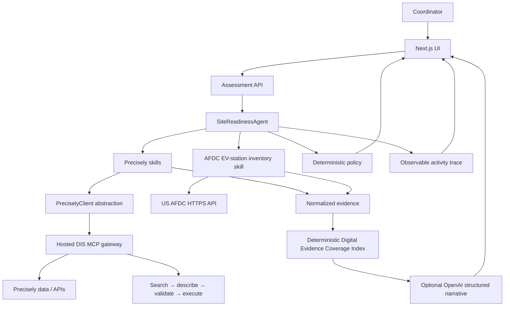

# Architecture

The browser submits only an installation request; it cannot name or invoke MCP tools. The agent runs optional contact checks, then address resolution. An unresolved address stops all site-specific enrichment. On resolution, independent Precisely skills, the AFDC public EV-station lookup, and the service-area skill run concurrently.

The hosted Data Integrity Suite MCP gateway is the active Precisely integration. Every approved capability follows search → describe → schema validation → execute. The app uses it for address identity, coordinates, property/building/parcel/roof observations, tax and AHJ context, timezone, nearby physical places, and routing. Precisely results remain distinct from AFDC data and InstallIQ calculations.

The final policy and the Digital Evidence Coverage Index are deterministic. The index has published weights for returned site identity, service-area, property, jurisdiction, and public-EV-infrastructure evidence. It is a data-coverage measure only—not a feasibility, site-quality, permitting, cost, capacity, or approval score. OpenAI is optional and explanation-only: it receives normalized facts plus that fixed breakdown, has no tools, cannot change policy or score, and is constrained to state data limitations rather than infer electrical capacity, permits, utility approval, costs, site control, or charger availability.
